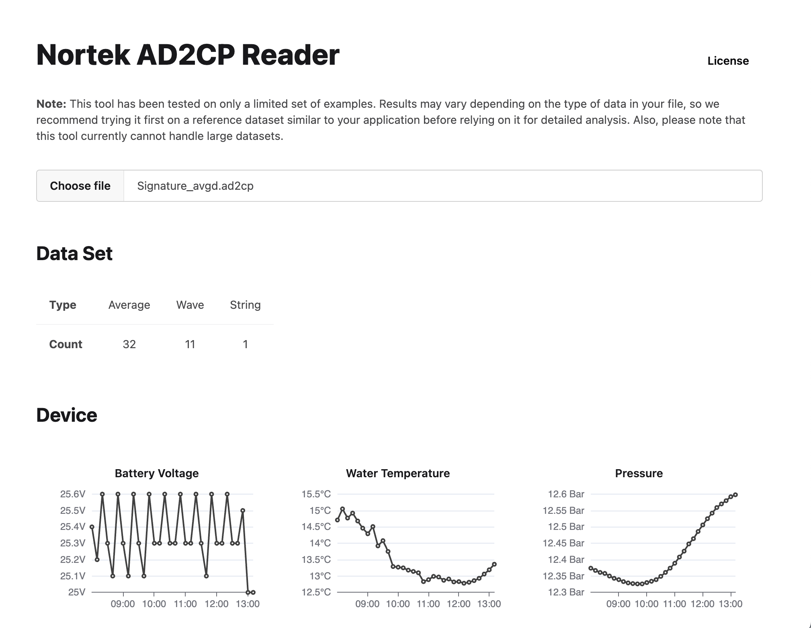

# Nortek AD2CP Reader

Read Nortek AD2CP files using a fully offline, don't-install-anything HTML app!



## Using

Just [download](https://github.com/subnero1/nortek-ad2cp-reader/releases/) and double-click!

## Building

```bash
npm install
npm run dev  # For developing
npm build  # To make the final build
```

This requires [node.js](https://nodejs.org/) to be installed.

## Contributing

Want to add your own custom plot? Spotted something that's not quite right? Raise an issue or PR and let us know! However, please be advised that we may at some point integrate parts or all of this tool into our [SWIS-ADCP product](https://subnero.com/solutions/swis) (under the usual T&C of the MIT license). By contributing to this repository, you are acknowledging that you are okay with this.
